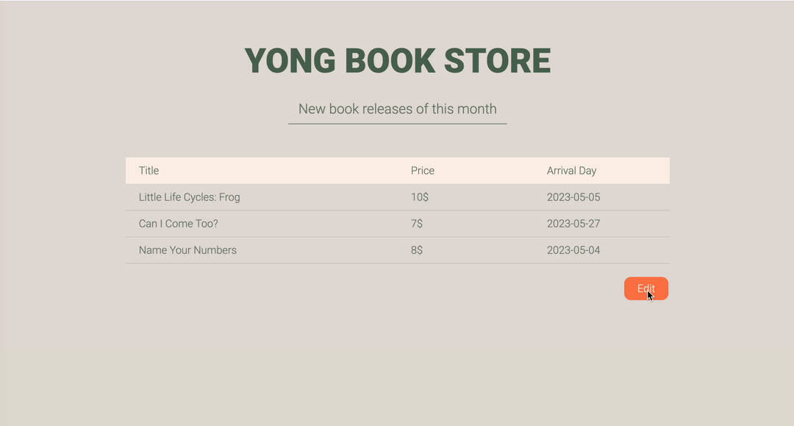

# Book Store - Monthly New Releases

This is a simple Flask and SQLAlchemy based web application that allows you to manage, edit, and display the latest monthly book releases.  
The main purpose of this project is to practice create an application with Flask and SQLAlchemy.

## Features

- Add and edit book entries for the current month
- Display a list of new book releases



## Technologies

- Flask: A lightweight Python web framework
- SQLAlchemy: A powerful and flexible Object Relational Mapper (ORM) for Python
- HTML/CSS: For designing and visually appealing web pages

## Getting Started

### Prerequisites

- Python 3.6 or higher
- Flask and SQLAlchemy
- MySQL Server

### Installation

1. Clone the repository to your local machine  
```
git clone https://github.com/ydroal/flask_app_bookstore.git
```

2. Change to the project directory

3. Create a virtual environment and activate it

4. Install the required packages

5. Install and configure a MySQL server, create a database, and set up a user with the necessary privileges.

6. Set environment variables for database connection:
```
export USER=<your_mysql_username>
export DB_PASSWORD=<your_mysql_password>
export HOST=<your_mysql_host>
export DB=<your_mysql_database>
```

7. Set environment variables for Flask and run the application
```
export FLASK_APP=app
export FLASK_ENV=development
flask run
```

Now, you can access the application at `http://localhost:5000`.

# Note
 
I don't test environments under Linux and Windows.

## Acknowledgments

- [Flask](https://flask.palletsprojects.com/)
- [SQLAlchemy](https://www.sqlalchemy.org/)


